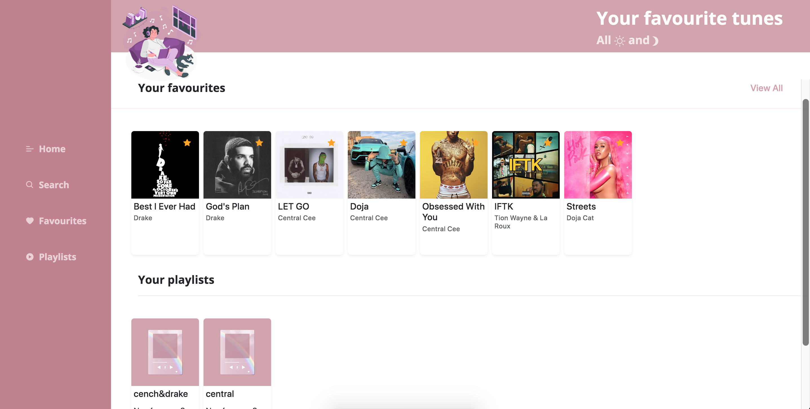

# Musicfy

A single page web React app which utilizes the [Keycloak javascript adapter](https://www.keycloak.org/docs/latest/securing_apps/index.html#_javascript_adapter) and [Shazam API](https://rapidapi.com/apidojo/api/shazam/) for fetching music tracks.
You can create playlists, add songs to favourites and also search for songs.

Docker compose is used to start nginx and Keycloak. Once its running you
now can experiment with the React code and learn about Keycloak
features using its administration UI.

# Getting started

To run the React app built from this repository, you will need to have [Docker
Composed installed](https://docs.docker.com/compose/install/).

Start the nginx server that serves the React app using the provided [app.sh](app.sh) script.

## The environment and logging in

When the docker compose images are running the end result is a
Keycloak server with a `Musicfy Realm` and a `musicfyclient` client
defined in that realm.

**Create a user on the Keycloak authentication screen so that you can view the `secured
component` of the React UI** The password for the `admin` user can be found in the
[docker-compose.yaml](docker-compose.yaml) file.

Visit the [React UI](http://localhost:3000/) with a browser and you should see a
link to the `secured component`(homepage of Musicfy). Clicking on that link will re-direct your
browser to the Keycloak server. Enter the user and password you
created above and the UI changes to reveal secured content e.g. the user Name and
Email.

# Making changes

To develop on your local system, you will need to have [Docker
Composed installed](https://docs.docker.com/compose/install/) and a
your favorite editor...

Docker Compose will download the [Keycloak
image](https://hub.docker.com/r/jboss/keycloak/) to run the Keycloak
server and a Postgres database.

Building the image locally can be done using the provided
[build-run.sh](build-run.sh) script. You may want to edit it to
change system specific details such as open port numbers.

The password for the `admin` user can be found in the
[docker-compose.yaml](docker-compose.yaml) file. Both the username
and password are configured via environment variables which can be
changed either in the docker-compose.yaml file or on the
docker-compose command line in the build.sh file.

The default port for the React UI is [3000](http://localhost:3000/) and the Keycloak UI
is [8080](http://locahost:8080/). Use the `docker ps` command to determine the
actual ports for your system.

# Thanks

Thanks to these two wonderful developers, their code was a lof of help:

[MichaelJThomas](https://github.com/MitchellJThomas/keycloak-react-app)

[Eabykov](https://github.com/eabykov/keycloak-compose/blob/main/compose.yml)
